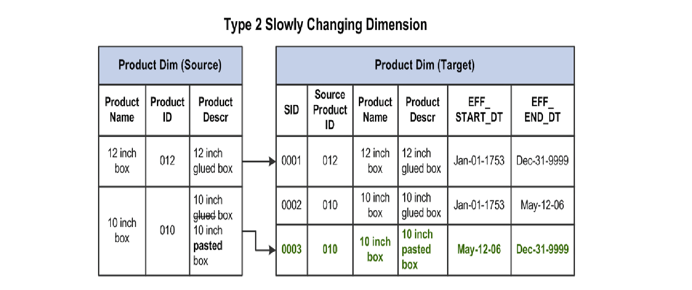

### Databricks PySpark Type 2 SCD Function for Azure Synapse Analytics





Slowly Changing Dimensions (SCD) is a commonly used dimensional modelling technique used in data warehousing to capture the changing data within the dimension (Image 1) over time. The three most commonly used SCD Types are 0, 1, 2.
The majority of DW/BI projects have type 2 dimensions where a change to an attribute causes the current dimension record to be end dated and a new record created allowing for a complete history of the data changes. See example below

# Data Before


# After


I used this in my latest project which was with an electrical distribution company with the aim to track the approved Australian Energy Regulator Tariff changes over time.
Today I’m going to share with you have to how to create a reusable PySpark function that can be reused across Databricks workflows with minimal effort.
Type 2 SCD PySpark Function
Before we start writing code we must understand the Databricks Azure Synapse Analytics connector. It supports read/write operations and accepts valid SQL statements in pre-action or post-action operations before or after writing to the table. Therefore to create this function the code must form the valid SQL statement that it passes to the connector.

## Prerequisite

Functionality
Azure Synapse Staging and Destination tables must be created for optimal performance and storage
The function accepts an input Dataframe
When lookup columns are passed to the function they are used to join the staging and destination tables. The lookup columns provide the ability to only close off rows coming in from the Input Dataframe that are currently open in the destination table with an Effective End Date of 9999–12–31 with the current date-time
If no lookup column(s) are passed no join condition is used and all current records are closed off and all the new input records are the open records
The function is capable of handling different input different Date\DateTime formats and will output a uniform DateTime format agreed with the business. Example below:
Input Format: 01/01/2020 or 2010–01–01
OuputFormat: 2020–01–01 00:00:00.000
* Close off the currently open records — depending on the Lookup columns provided
* Insert the new data set setting the new record with an Open DateTime of ‘9999–12–31 00.00.00.000’

Input Parameters
* Dataframe df
* outputDWTable: Name of the output Synapse Analytics Table e.g. DW.Tariffs
* outputDWStagingTable: Name of the output Synapse Analytics Staging Table e.g. DW.StagingTariffs
* dateParameters: Takes the following in Json KeyValue Pairs

```
{
“scd_effective_date_column”:”<Enter Here - Input Date Column>”,
“scd_end_timestamp_column”:”<Enter Here - SCD EndDate Column Name>”,
“scd_start_timestamp_column”:”<Enter Here - SCD StartDate Column Name>”, -
“scd_TimeStampFormat”:”<Enter Here — Source Date Format, this is used to convert to destination DateType>”,
“lookupColumns”:”<Enter lookupcolumn(s) pipe seperated>”
}
```
Code
Please see the comments on each block of code for an explanation.


Conclusion
If you would like a copy please drop me a message and I can send you a link to my private GIT repo.
I hope you have found this helpful and through its use, will save you time writing a PySpark Type 2 SCD function. Any thoughts, questions, corrections and suggestions are very welcome :)

